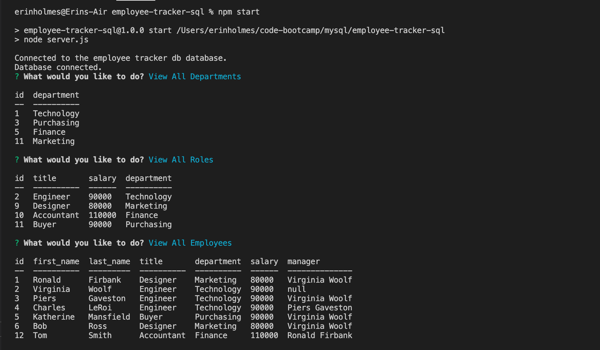

# Employee Tracker
## SQL Programming Challenge

## Description
This repo contains code to manage an employee database using node.js, npm, inquirer, and mysql2. All interactions with this application occurs via the command line. This application uses node.js and mysql to perform CRUD operations on the sql database. Since this application will not be deployed, the video walkthrough below demonstrates the apps functionality. 

## Table of Contents
* [Installation](#installation)
* [Usage](#usage)
* [Contributing](#contributing)
* [Video Walkthrough](#video-walkthrough)
* [Questions](#questions)

## Installation
To install any necessary dependencies run the following command: 

    npm install

## Usage 
After cloning the repo to your local machine, open the package in an IDE. Make sure you have node.js and npm installed (hint: `node -v` & `npm -v`). In the package root directory, install the following packages: inquirer.js, mysql2, and console.table (`npm i inquirer mysql2 console.table`). Once all dependencies are installed, initiate the program by running `npm start` from the terminal in the root directory. The user will be prompted with a list of questions that will utilize sql queries to either create, read, update, or delete information on the database. Select "Quit" to exit the application.

## Video Walkthrough
[Watch video walkthrough](https://drive.google.com/file/d/1N4fXnlnD3Ii7IW3Umd8IdZfcXwV5lcD_/view)

## Invoking application in terminal

## Questions
If you have any questions or feedback, create a new issue and add the label "question". 
View more of my work: [github.com/emholmes](https://github.com/emholmes).
